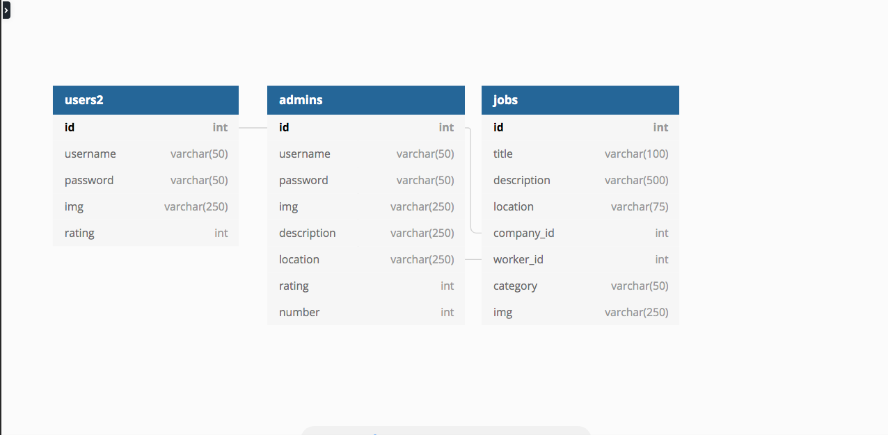
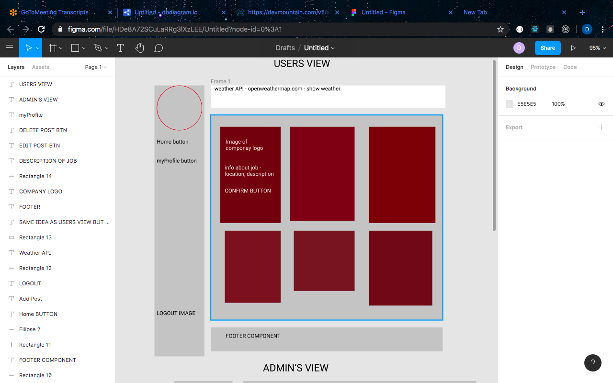
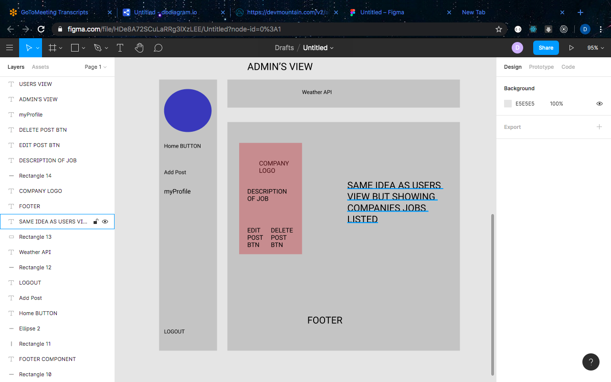

# App - U-Hired
## What Is The Purpose Of This App?
I want people to be able to easily find available jobs within their area.

## What Problems Does This App Solve?
This app will help people find jobs and employers find workers.

## How Does This App Solve Those Problems?
Unlike a job application where you wait for the employer to view your application, this app instantly lets you know if you have a shift coming up.

## Who Is Your Target User?
Businessman and casual users.

## How Much Experience Do They Have With Technology?
A little to moderate knowledge is acceptaple.

# M.V.P.
- App will have a feed showing all available jobs.
- Users can select a job and immediately a confirmation of work.
- Admins can post, delete, or edit job posting.

## Added Features
- User can rate, and/or review that job/company.
- Company can rate and/or review that User.
- Narrow job posts by category.
- User/Company Profiles that shows more detailed info about them.

# Components
- App.js - Holding Navbar, Footer and routes.
- Home.js - Has login input boxes (email, password) with login and register buttons.
- Dashboard.js (User) - See a list of job postings in area.
- Dashboard.js (Company) - See Job postings listed.
- Posts.js - View each individual post with detailed information.
- Post.js - Add new jobs

## Routes
- / => Home Page/Login
- /admin => Admin Login
- /dashboard => Job Postings
- /admin/dashboard => Job listings posted
- /dashboard/:id => Specific Job Post page
- /dashboard/myjobs => Upcoming Jobs Scheduled to work
- /myprofile => User's/Company Profile
- /dashboard?category=${category} => List of jobs within that category
- /admin/post => Create new job with description.

## Schema
- seed.sql
```
CREATE TABLE users2 (
    id serial primary key,
    email varchar(100),
    username varchar(50),
    password varchar(50),
    img varchar(250),
    rating int
);
CREATE TABLE admins (
    id serial primary key,
    email varchar(100),
    username varchar(50),
    password varchar(50),
    img varchar(250),
    description varchar(250),
    location varchar(250),
    rating int,
    number int
);
CREATE TABLE jobs (
    id serial primary key,
    title varchar(100),
    description varchar(500),
    location varchar(75),
    company_id int references admins(id),
    worker_id int references users(id),
    category varchar(50),
    img varchar(250)
);
```
- get_jobs 
```
SELECT id, title, description, location FROM jobs;
```
-  get_job_posting/confirmed jobs
```
select * from jobs where company_id/user_id = req.user.id
```

- add_job 
```
insert into jobs(title, description, location, company_id, category. img)
values($1, $2, $3, $4 => req.user.id, $5, $6 => req.users.img);
```

- get_user
```
SELECT * FROM users WHERE id = $1; => req.session.user
```

- get_admin
```
SELECT * FROM admins WHERE id = $1; => req.session.admin
```
- delete_post 
```
DELETE FROM jobs WHERE id = $1;
```
- edit_post
```
UPDATE jobs
SET title = 'Physician', etc...
```
## Server
App.GET - '/dashboard' => all postsings for user to see

App.GET - '/admin/dashboard' => all postings company posted

App.POST - '/admin/post' => Create new job to add to jobs table

App.DELETE - '/admin/:id' => Deletes post

App.PUT - '/admin/:id' => Alter's jobs data set.
## Technologies
- SASS
- openweathermap
- Google Maps for job posting
### Wireframe


=
